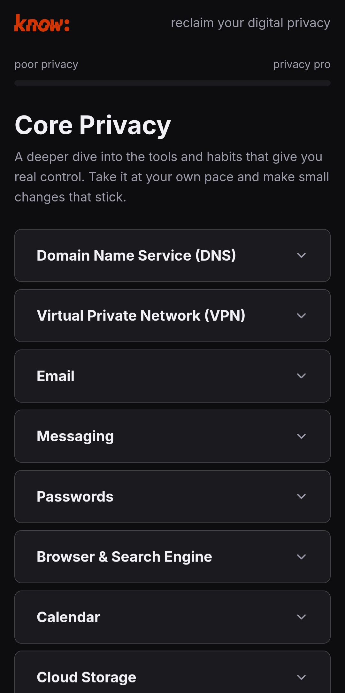
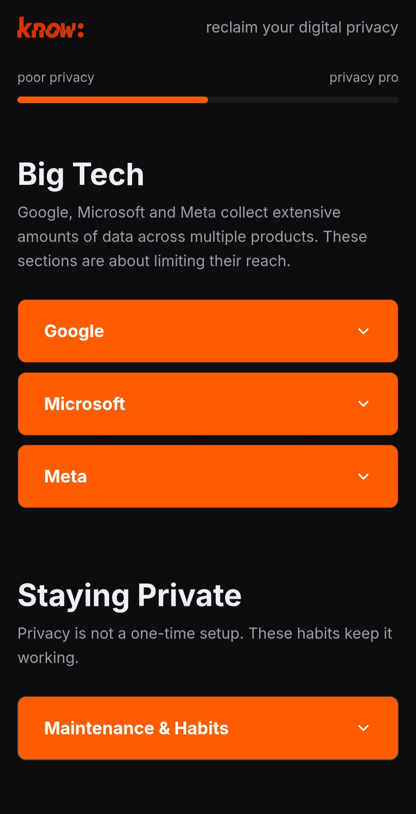
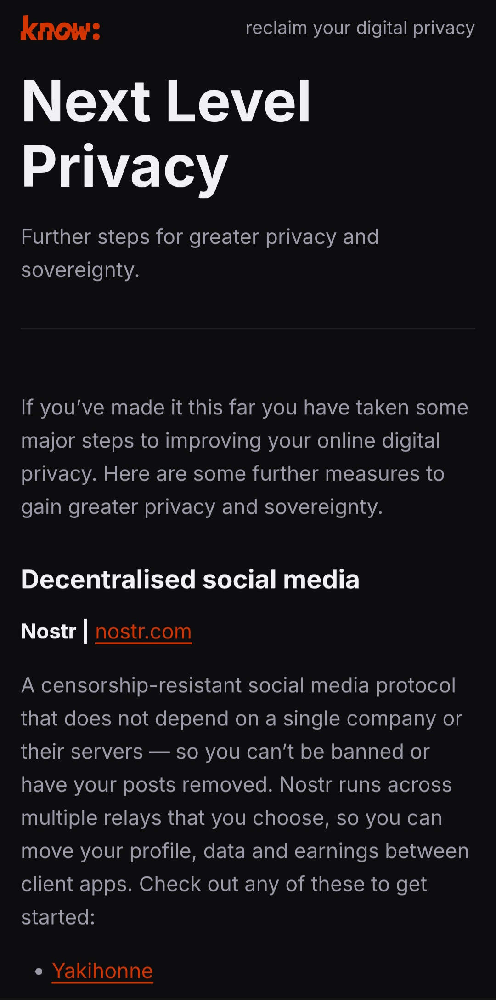

# Know

A practical guide to reclaiming your digital privacy.

## Screenshot

## Features

- Getting Started: what's at stake, what you can do, and your digital profile
- Core Privacy: step-by-step guidance across DNS, VPN, email, messaging, passwords, browser and search, calendar, cloud storage, video conferencing, office tools, AI, and shopping
- Big Tech: practical steps to limit data collection from Google, Microsoft, and Meta
- Staying Private: ongoing habits and maintenance, not a one-time setup
- Progress tracked locally in your browser, nothing leaves your device
- Curated provider recommendations and further reading for every topic

## Tech Stack

- Hugo static site generator
- Vanilla HTML, CSS, and JavaScript, no frameworks
- No backend, no analytics, no external fonts or CDN dependencies

## Running Locally

Requires Hugo installed.

    git clone https://github.com/jaquesbody/know.git
    cd know
    hugo server

Then open `http://localhost:1313` in your browser.

## Privacy

Your progress through the guide is tracked locally in your browser only. Nothing leaves your device, no account, no servers, no app permissions. Fully open source — review the code on GitHub.

## Licence

Code and templates are MIT licensed — see [LICENSE](LICENSE). Guide content (everything in `content/`) is licensed under CC BY 4.0 — see [LICENSE-CONTENT](LICENSE-CONTENT).
